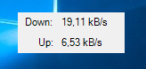

# BandwidthMonitor
Tiny helper which shows the current bandwith usage of your network adapter

Slight modification of this project:
https://www.codeproject.com/Articles/6259/Monitoring-network-speed

Automatically selects Ethernet adapter and wireless network card as fallback.
Always stays on top and can be moved to any position.

